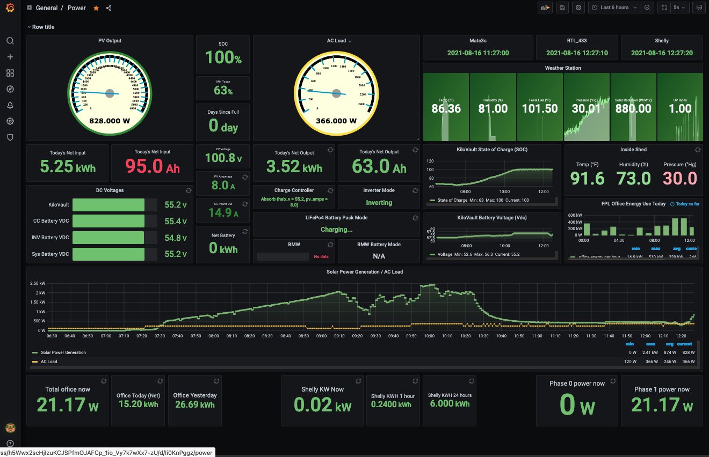
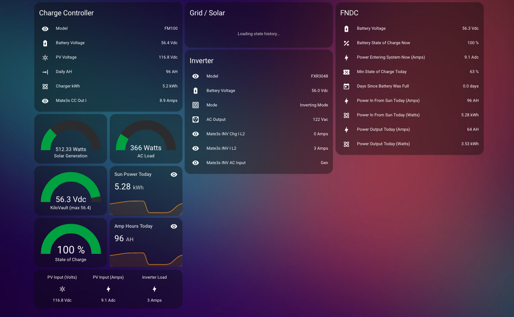

# Outback-Mate3s-Home-Assistant
Note, this is just the first upload for sharing some code as requested. 
I'll be adding help information, images, and so on when I have some time. 

For now, here are a couple of screenshots. 
The Grafana Dashboard:

The Lovelace view into the same data: 

