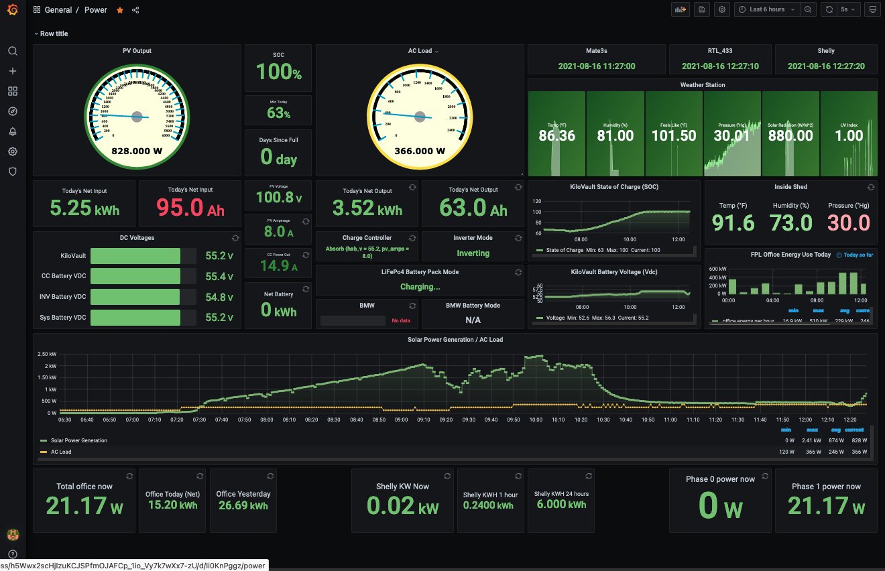
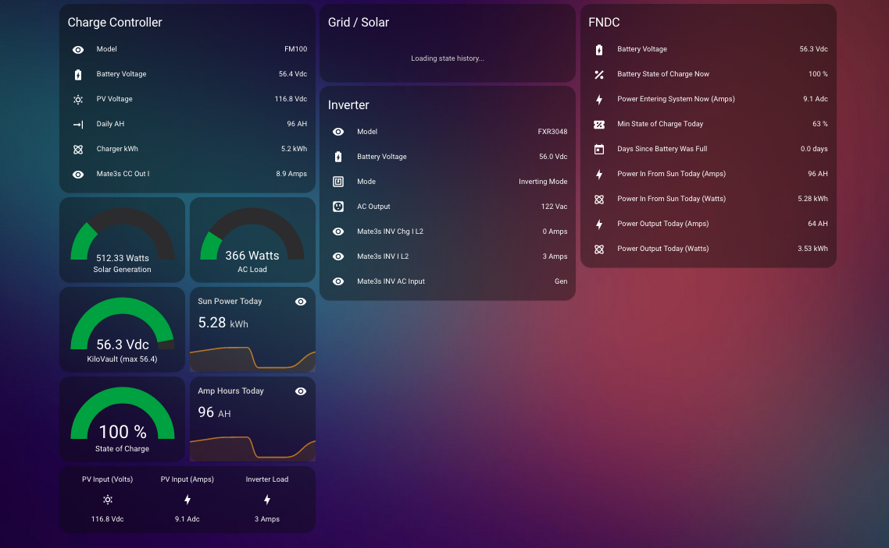

# Outback-Mate3s-Home-Assistant

# Information: 

This is just the first upload for sharing some code as requested. 
I'll be adding help information, images, and so on when I have some time. 

For now, here are a couple of screenshots. 
The Grafana Dashboard:

The Lovelace view into the same data: 

# Files and Here. 

Although this is not the complete system, I have uploaded the YAML files, the python code and the script which starts the python in the background (run in cron).  

I have also uploaded the grafana code to provide the screen. 

# Sources. 

I have multiple sources of data for this (not all shown in this repository). 

The first, and most obvious is the mqtt data coming from the Outback Mate3s system.
That is fed into sensors to display. 

The next is data from my weather station (code not here, but it is nice to know the current information on my dashboard). 

The final piece of data is from the rtl433 system, which provides realtime data from my power panel via shelly sensors. 

I'm going to eventually put the whole set of code, and complete description of what I did to get here, but for now, 
this should be enough for the folks who asked me for the information. 

